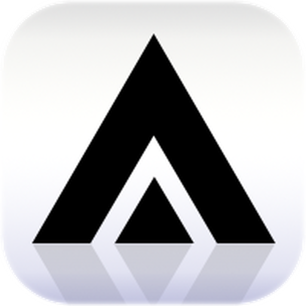

  

<h1 align="center">无限画布 Robin Version</h1>

基于 Infinite Canvas 的 Windows 桌面端二次开发版本

> [!CAUTION]
>
> > 本项目基于 basketikun/infinite-canvas 项目二次开发，更多关于原项目的介绍和文档，请访问 [basketikun/infinite-canvas](https://github.com/basketikun/infinite-canvas)。

无限画布是一款面向图片创作的开源工作台。它把画布编排、AI 图片生成、参考图编辑、对话助手、提示词库和素材沉淀放在同一个界面里，适合用来探索视觉方案并连续迭代图片结果。

## 核心功能

- 无限画布：多画布项目、节点拖拽缩放、连线、小地图、撤销重做、导入导出。
- AI 创作：浏览器前台直连你配置的 OpenAI 兼容接口，支持文生图、图生图、参考图编辑、文本问答、音频和视频生成。
- 画布助手：围绕选中节点和上游节点对话、生图，并把结果插回画布。
- 本地 Agent：通过本机 Canvas Agent 连接 Codex / Claude Code，让 Agent 通过 MCP 操作当前画布；
- Codex App 插件：提供 Codex app 插件，安装后会自动注册 MCP 并尝试拉起本地 Agent。
- 插件系统：支持通过 URL 动态安装 / 启用 / 更新 / 卸载远程节点插件，并提供 TypeScript SDK 自行开发画布节点插件。
- 自定义接口调用：可自定义生图 / 视频接口的调用方式，灵活适配各类中转站与自建服务。
- 提示词库：浏览器前端直连多个 GitHub 开源项目，并缓存到 IndexedDB。

完整功能说明见 [功能介绍](docs/content/docs/overview/features.mdx)。

## 各版本新增功能

### v0.15.2

- 迁移到上游 v0.15.1 MIT 基线，加入提示词放大编辑、本地存储统计、Agent Skill/画布资源引用和选择/移动工具。
- 加入 Windows Tauri 客户端、原生 HTTP 请求、系统另存为下载、Google Drive 团队库和 Robin Version 桌面图标。
- 元素组支持从白色悬浮工具区批量选择图片、视频、音频和文本文件，并支持把单个或多个画布元素拖入组内。
- 新建元素组自动按“元素组1、元素组2、元素组3……”编号；Ctrl + 拖动框选节点，Space + 左键拖动画布。

### v0.15.0

- 新增元素组、组内自动网格布局、成员缩略图排序和图片/视频组合提示词。
- 生成配置支持连接元素组、`@` 引用元素组、笛卡尔积批量生成，以及并发/依次两种执行方式。

### v0.14.9

- 图片大图预览支持滚轮缩放，并可使用中键或 `Space + 左键` 平移查看。
- 多选图片或视频后支持批量 ZIP 下载和按原相对位置复制。

### v0.14.8

- 新生成配置自动继承当前画布上一份配置参数。
- 支持将图片、视频、音频、文本文件或纯文字拖入画布，并支持拖到同类型节点上替换内容。
- 图片生成设置拆分为质量、1K/2K/4K 分辨率、宽高比和生成张数。

### v0.14.7

- Google Drive 团队库支持长期登录续期、共享文件夹及子文件夹浏览。
- “我的画布”卡片新增复制和重命名副本功能。

### v0.14.6

- 团队库设置支持导入 Google Cloud Desktop OAuth JSON。

### v0.14.4

- 团队库新增当前 Google 账号与登录状态、手动刷新和退出入口。

### v0.14.1

- 新增 Google Drive 只读团队库，可导入团队画布、资产和提示词。
- 新增无需 Docker 的 Windows NSIS 安装包、桌面原生 HTTP 通道和系统“另存为”下载。
- 新增面向 Robin0525 仓库的版本检查和 Codex 桌面插件工作流。

## 效果展示

<table width="100%">
  <tr>
    <td width="50%"></td>
    <td width="50%"></td>
  </tr>
  <tr>
    <td width="50%"></td>
    <td width="50%"></td>
  </tr>
  <tr>
    <td width="50%"></td>
    <td width="50%"></td>
  </tr>
  <tr>
    <td width="50%"></td>
    <td width="50%"></td>
  </tr>
</table>

## 赞助支持

本项目长期开放广告赞助合作，欢迎品牌 / 产品投放，你的支持是持续更新的动力！

有广告赞助意向请邮箱联系：ruriceann@gmail.com

## 开源协议

本项目使用 [MIT License](LICENSE)。任何人都可以免费使用、复制、修改、分发、再授权和商业使用本项目，也可以用于闭源产品。
